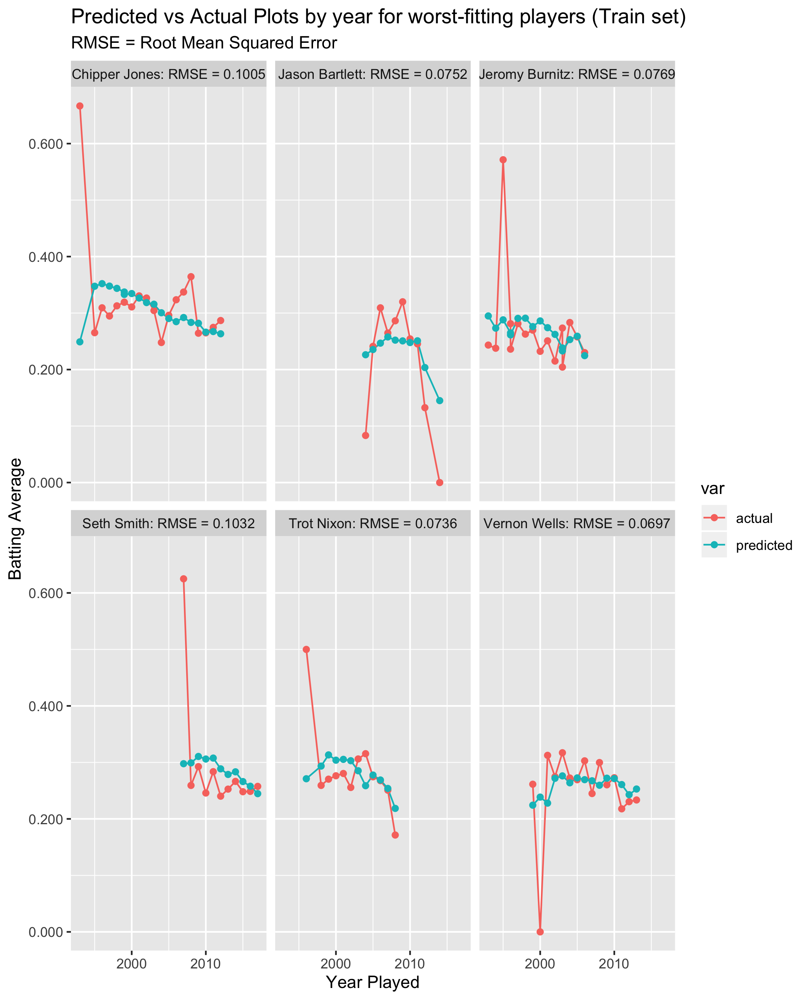
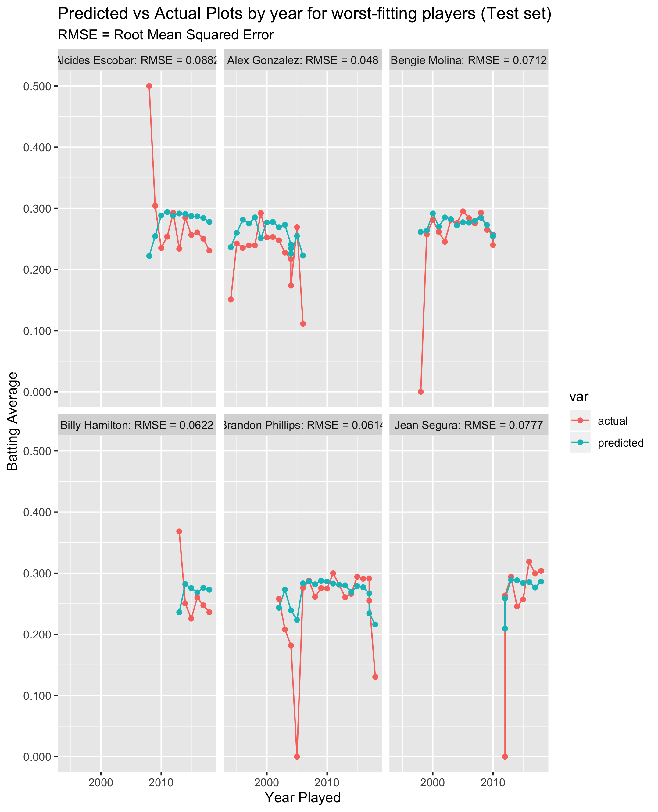

## Modeling MLB Statistical Batting Line with Linear Mixed Models

This is the remote repository for work demonstrating the use of LMMs to predict batting lines of Major League Baseball Players.

This work heavily references existing work, including:

- This talk by Don Hedeker https://bstt513.class.uic.edu/L1LS_SAS_SPSS.pdf
- The excellent documentation of SAS's proc mixed: https://support.sas.com/documentation/cdl/en/statug/63033/HTML/default/viewer.htm#statug_mixed_sect022.htm
- A discussion of Stein's paradox describing the benefits of shrunken fixed effects parameters: http://statweb.stanford.edu/~ckirby/brad/other/Article1977.pdf

Predicting MLB player statistics into the future is challenging for reasons, but here are two:

-	Small data. A long illustrious career will be over in 20 years. Even if we study a batting line on a monthly basis instead of yearly, the number of rows needed for a typical machine learning model would be insufficient. 
-	There is inherent correlation. It stands to reason that seasons (or months) that are closer together are more similar than seasons (or months) that are farther apart in a players’ career. One technique that might be considered is a time series, but that too may require more data than we have at our disposal. Generating predictions for new young players – while not impossible – would also be challenging.

The LMM allows us to account for between-player differences while accounting for correlated measures of the same player over time. 

## Brief description

This work pulls data from the [Lahman](https://github.com/cdalzell/Lahman) package. The LMM is fit with batting average as the target and the following as fixed effects:

- GS = Games started in a season
- soPer = strikeout percentage of outs
- yearService = the number of years the player has been in the league at the time of observation

Data is gathered and collected in the `buildModels.R` code using mostly [tidy data principles](https://r4ds.had.co.nz/tidy-data.html).

The following random effects are used:

- intercept
- slope (yearService)

This creates a player-specific change to the population-level intercept and yearService coefficients.

## Preliminary Results

A train/test set was created to demonstrate the efficacy of this model on players that have not been included with the model construction. For simplicity I pulled data for all players debuting at or after 1993 and only considered mostly starters and careers lasting at least 5 years.

Root mean square errors were calculated for each player. Despite the simplicity (and frankly lack of data) collected, the models perform quite well.  Latent player-specific effects are powerful.

Here are the predicted/actual batting averages for the worst-fitting players in the training data set:

For being the players with the 6 worst RMSEs in the model, they do quite well. Perhaps not surprising as they're from the training set.

Here are the worst 6 from the test set. Here I should note that the test set contains player careers not used to train the model. Since they were not included in the original model, their predictions are only on the level of the fixed effects (i.e. no player-specific correctios to the intercept and yearService coefficients). 

This is still more effective than an ordinary least squares model, as the fixed effects parameter estimates are shrunk as described in the Efron link above.

## Future Work

In practice we'll want to use all the data available to use. In the near future I'll demonstrate how to use LMMs to take the first 3 years of performance to predict the next few years of batting averages (existing functions were written years ago and changes to packages seem to have broken some of them).
